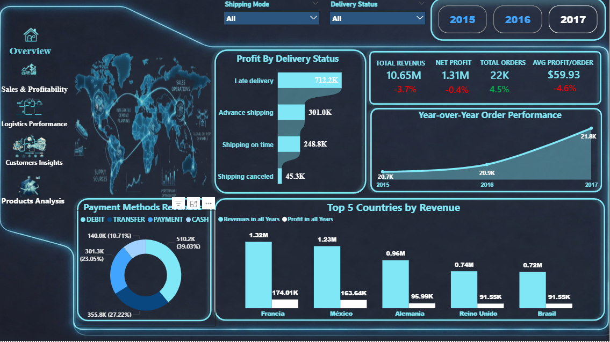
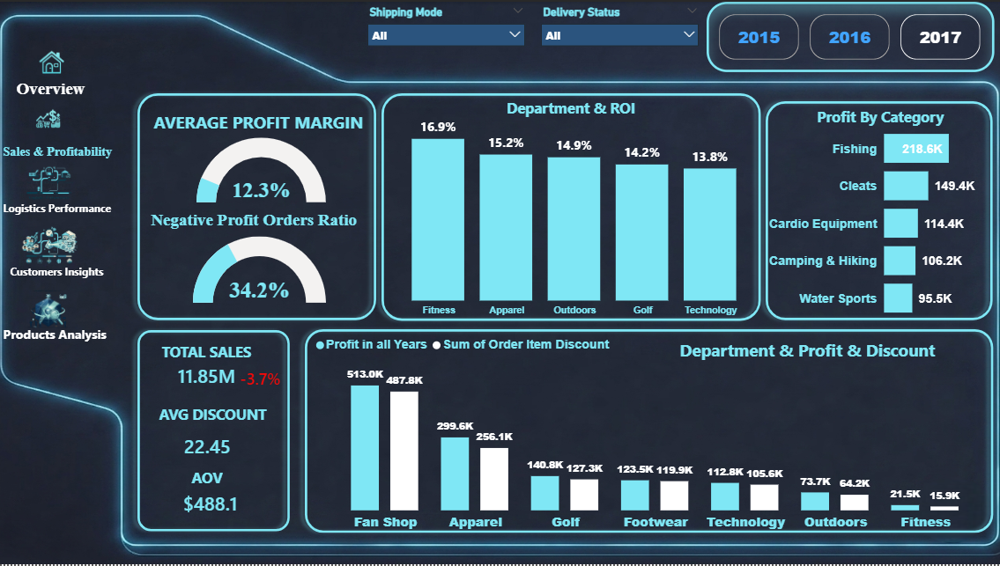
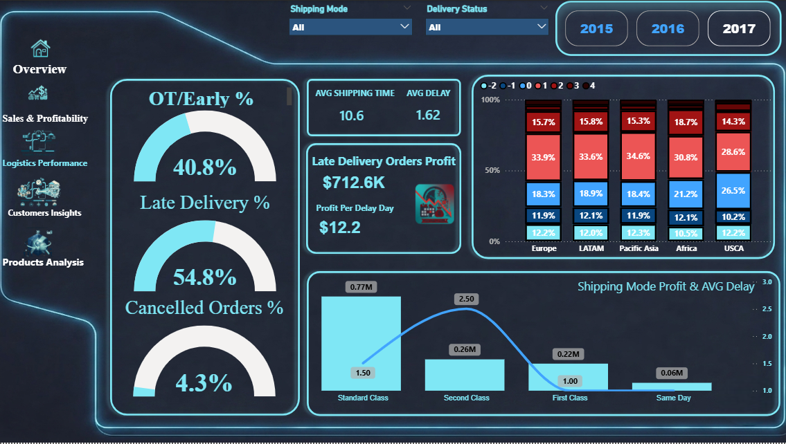

# 📦 Supply Chain & Profitability & Logistics Performance Analysis

## 📑 Table of Contents
- [Overview](#-overview)
- [Business Problem](#-business-problem)
- [Key Insights](#-key-insights)
  - [Revenue & Profitability](#1-revenue--profitability)
  - [Logistics Performance](#2-logistics-performance-critical-issue)
  - [Customer Behavior](#3-customer-behavior)
  - [Regional Performance](#4-regional-performance)
  - [Product & Department Performance](#5-product--department-performance)
  - [Payment Methods](#6-payment-methods)
- [Root Cause Analysis](#-root-cause-analysis)
- [Recommendations](#-recommendations)
- [Technical Approach](#-technical-approach)
- [Dashboard Preview](#-dashboard-preview)
- [Repository Structure](#-repository-structure)
- [Key Takeaways](#-key-takeaways)
- [Future Improvements](#-future-improvements)
- [Author](#-author)

---

## 📌 Overview
This project presents a comprehensive analysis of a Supply Chain and Sales dataset with the goal of uncovering key insights related to business performance, operational efficiency, customer behavior, and regional trends.

Despite achieving a **+4.5% year-over-year increase in total orders**, the company experienced a decline in both revenue quality and profit per order, indicating that growth is driven by volume rather than value.

---

## 🎯 Business Problem
Although the business is growing in terms of order volume, several underlying issues are negatively impacting overall performance. Revenue per order is declining, customer retention is weakening, and delivery delays are significantly high.

This project aims to identify the root causes behind these challenges and provide actionable insights to improve profitability and customer experience.

---

## 📊 Key Insights

### 1. Revenue & Profitability
The total number of orders increased by **4.5% YoY**, but the **Average Order Value (AOV)** dropped from **$529 to $488**, indicating lower spending per transaction.

The **average profit per order decreased by approximately 4.6%**, mainly due to increased discounting, where the **average discount rose from $20 to $22**. While the **profit margin slightly increased by 0.5%**, it was not sufficient to offset the decline in revenue quality.

---

### 2. Logistics Performance (Critical Issue)
Logistics performance is a major concern, as **54.8% of orders are delivered late**, while only **40.8% are delivered on time or earlier**. Additionally, **4.4% of orders are canceled**.

The **Second Class shipping mode**, although highly profitable, has an average delay of **2.5 days**, which significantly impacts customer satisfaction. The company generates **$12.2 profit per delay day**, indicating a reliance on inefficient operations.

---

### 3. Customer Behavior
The number of new customers increased by **50%**, reflecting strong acquisition efforts. However, **customer retention decreased by 4%**, suggesting that customers are not satisfied enough to return.

This is likely driven by poor delivery performance and overall customer experience.

---

### 4. Regional Performance
The **United States market declined dramatically**, dropping from approximately **40% of total profit to less than 1%**.

In contrast, the **LATAM market surged**, contributing **44% of total profit** after being recently reopened. This highlights a major shift in regional dependency.

---

### 5. Product & Department Performance
The **Fishing category** is the top-performing segment, generating **$218.7K in profit (16.7% of total profit)**.

The **Fitness department** achieved the highest ROI and has maintained its leading position for three consecutive years.

---

### 6. Payment Methods
**Debit Card payments** contribute the highest share of profit at **39%**, while **Cash payments** contribute only **11%**, making them the least profitable method.

---

## 🔍 Root Cause Analysis
The decline in performance is driven by multiple factors. Increased discounting and lower AOV are reducing revenue quality, while logistics inefficiencies—especially high delivery delays—are negatively affecting customer satisfaction.

Additionally, the business appears to rely on delay-driven profitability, which is not sustainable. The decline in customer retention and the collapse of the US market further highlight deeper operational and strategic issues.

---

## 💡 Recommendations
The company should prioritize improving logistics performance by reducing late deliveries and optimizing shipping modes. Redesigning the discount strategy and focusing on personalized offers can help improve profitability.

Customer retention should be enhanced through loyalty programs and better post-purchase experiences. The US market requires a detailed reassessment, while the LATAM market should be further scaled.

Finally, increasing revenue per order through upselling and bundling strategies can help improve overall performance.

---

## 🛠️ Technical Approach

### Data Preparation
The dataset was cleaned by handling missing values, fixing inconsistencies, correcting date columns, and removing duplicates.

### Data Modeling
A **Star Schema** was implemented with a central Fact table (`FactOrders`) and multiple Dimension tables such as Customers, Products, Categories, Departments, Locations, and Shipping.

A Date table was also created to enable Time Intelligence analysis.

### Data Analysis
Key KPIs were developed using DAX, including AOV, Profit per Order, Delivery Performance, Retention Rate, and YoY growth metrics.

### Dashboard Design
An interactive Power BI dashboard was built with sections for executive insights, logistics, customer behavior, and regional analysis, supported by slicers and filters.

---

---

## 📸 Dashboard Preview

This section provides a visual overview of the Power BI dashboard. Each page focuses on a specific business area to deliver clear and actionable insights.

---

### 📊 1. Executive Overview
This page provides a high-level summary of overall business performance, including key KPIs such as total orders, revenue, profit, and growth trends over time.




---

### 🌍 2. Sales & Profitability
This page explores performance across different markets, showing profit distribution, regional trends, and market shifts over time.




---

### 🚚 3. Logistics & Delivery Performance
This page analyzes shipping performance, highlighting late deliveries, on-time rates, average shipping time, and performance across different shipping modes.



---

### 👥 4. Customer Insights
This page focuses on customer behavior, including new vs returning customers, retention rate, and customer segmentation.


---

### 🛍️ 5. Product & Category Performance
This page highlights top-performing products, categories, and departments based on profit and ROI.


## 📂 Repository Structure

```bash
Supply-Chain-Sales-Analysis/
│
├── Dataset/
│   └── raw_data.csv
│
├── PowerBI/
│   └── dashboard.pbix
│
├── Screenshots/
│   ├── overview.png
│   ├── logistics.png
│   └── customers.png
│
├── DAX_Measures.md
└── README.md
```

---

## 🚀 Key Takeaways
This project demonstrates that growth in order volume does not necessarily translate into business success. Sustainable growth requires strong revenue quality, efficient operations, and a positive customer experience.

---

## 📎 Future Improvements
Future enhancements may include adding forecasting models, performing cohort analysis, integrating inventory data, and building automated data pipelines.

---

## 👤 Author
**Saeed Mohamed**  
Data Analyst | Power BI Developer
